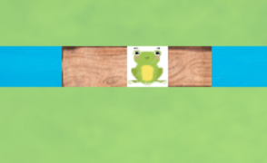
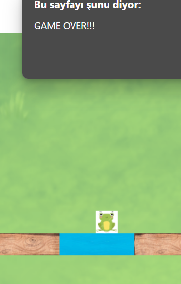

# Forward-Frogs

## Projede Kullanılan Teknolojiler
Html5, cnvas ve javascript kullanılarak geliştirilmiş bir oyundur.

## Proje Özeti ve Özellikleri
Oyunda kurbağalar sürekli ve otomatik olarak ilerler.
Oyuncu space tuşuna basarak odunların hızını arttırır ve kurbağaları odun üzerinde karşıya geçirmeye çalışır.
 

 
Bu esnada herhangi bir kurbağanın altında odun yoksa kurbağa nehire düşeceği için oyun biter.
 

 

## Oynanış Videosu
https://youtu.be/GwNq0l4dtEs

## Projeyi Çalıştırmak
Tarayıcınızda `index.html` dosyasını açarak oyunu oynayabilirsiniz.
